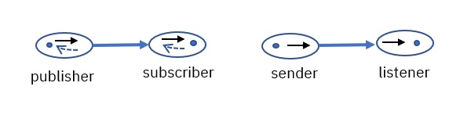

# kabanero-events-otc

Kabanero events and OTC integration

## Introduction

OTC (Open Tool Chain) is an open source infrastructure for managing tools in a cloud environment. Examples of tools include 

- IDEs
- Github repositories
- Tekton pipelines
- Slack

OTC allows users to

- Discover available tools
- Create instances of tools
- Link tools so that they work together.

Examples of scenarios include:

- Create a new github repositories
- Create an IDE instances that automatically discovers and works with repository instances.
- Create web hooks and run build pipelines.

The project is contains a prototype for linking Kabanero and OTC together.

## Terminologies

An `OTC broker` manages the life cycle of a tool. 
For example, a broker for an IDE is responsible for creating and deleting instances of that IDE.

An `OTC service` represents an instance of a tool. For example, each instance being managed by an IDE broker is a service.

An `OTC tool chain` is a collection of `services` that work together. 
For example, you may have one tool chain that contains a github repository service for a specific repository, an IDE for the repository, and a pipeline to build the repository.
It is possible for a `service` to be bound to multiple tool  chains.

OTC allows you to 

- Discover available `brokers`, each representing a different tool.
- Create `services`, or tool instances, for each `broker`.
- Define parameters, if required, for each `service`.

## Goal of Kabanero OTC Integration

The goal of Kabanero OTC Integration is to enable OTC to make use of the Kabanero infrastructure. 
The proposed mapping from Kabanero to OTC is:

- One or more Kabanero to OTC brokers may be installed, each providing different integration points.
- Each Kabanero to OTC broker is an add on, may be used to manage more than one Kabanero installations.
- The first proposed broker are:
 - Kabanero broker
 - Kabanero events broker
 
 The Kabanero broker is responsible for managing the life cycle of `Kabanero` instances.  
 When creating a `Kabanero  service`, the broker is supplied with information about a specific Kabanero instance (from a specific Kabanero install).  
Future changes may allow the `Kabanero service` to create/delete Kabanero instances. 

Associated with each Kabanero instance is a set of resource that need to be exposed as additional services. These include:

- Repositories that store kabanero event triggers
- Repositories that store Tekton pipelines

The `Kabanero service` is responsible for maintaining the life cycle of the  `github` service for the above repositories.
- when a Kabanero service is created, the corresponding `github service` for the above repositories are created.
- when a Kabanero service is deleted, then correpsonding `github service` for the abvoe repositoreis are deleted.

The Kabanero `Kabanero events` broker is used to manage the event triggers within each Kabanero instance. 

The Proposal for the Tekton broker is that it works in a similar way to the Kabanero broker. It is a separate install capable of managing multiple Tekton installations.

## Kabanero Events Broker

There is one `Kabanero Events Broker` per Kabanero installation. 
The input parameter to creating a  `Kabanero Events Service` is the kabanero installation. 
Once created, the `Kabanero Event Service` is responsible for managing `Kabanero Event Trigger` services.
**TBD: Should Kabanero Event Service be auto-created?**

Once a `Kabanero Events Service` is created, it manages the `Kabanero Event Triggers` as follows:

- There is a one to one mapping between an event trigger within a Kabanero instance to a `Kabanero Event Trigger` service.
- When a trigger is created, the `Kabanero Events Service` creates a new `Kabanero Events Trigger`.
- When a trigger is updated, the `Kabanero Events Service` updates the `Kabanero Events Trigger`.
- when a trigger is deleted, the `Kabanero Events Service` deletes the  `Kabanero Events Trigger`.
- Note that `Kabanero Event Triggers` are managed through gitops. The `Kabanero Event Service` can not be used to create/delete/update the event triggers themselves.

